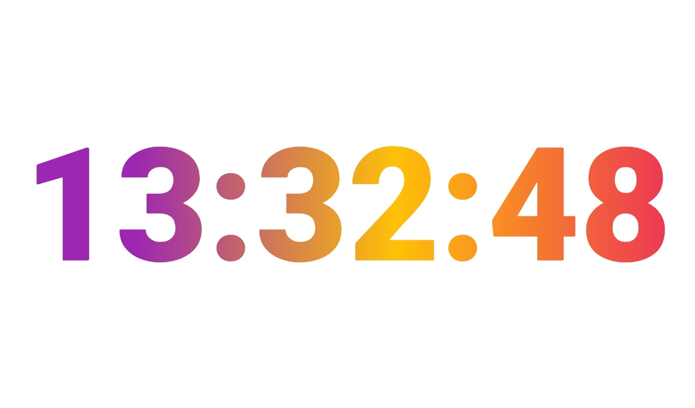

# flutter_clock
Code for Flutter Clock competition. Builds upon code provided by Flutter for the Digital Clock.

I've changed it so that the colour of the seconds, minutes and hours change depending on the time with a gradient effect. The colour of the seconds changes every second, the colour of the minutes change every minute and the colour of the hours change every hour.

I aimed for a an easy to read design using no assets, just pure Flutter.

The modified code to get this effect is in flutter_clock/digital_clock/lib/digital_clock.dart

