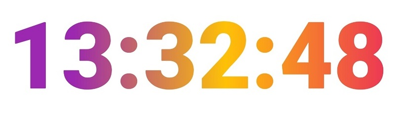

# Digital Clock

This app builds on the example digital clock provided by flutter

I've changed it so that the colour of the seconds, minutes and hours change depending on the time with a gradient effect. The colour of the seconds changes every second, the colour of the minutes change every minute and the colour of the hours change every hour.

